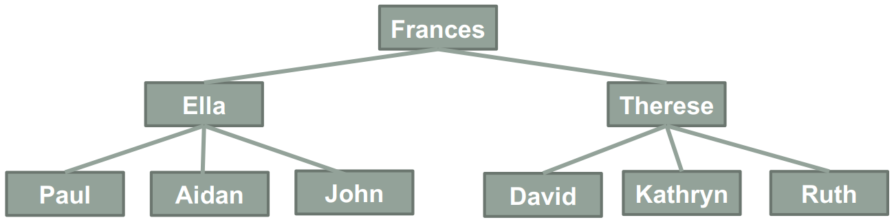
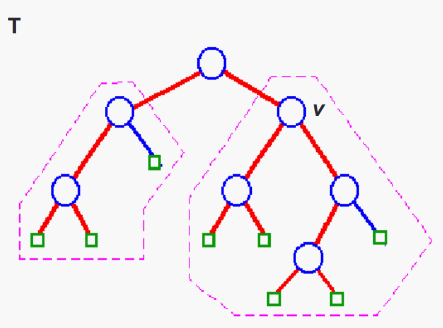
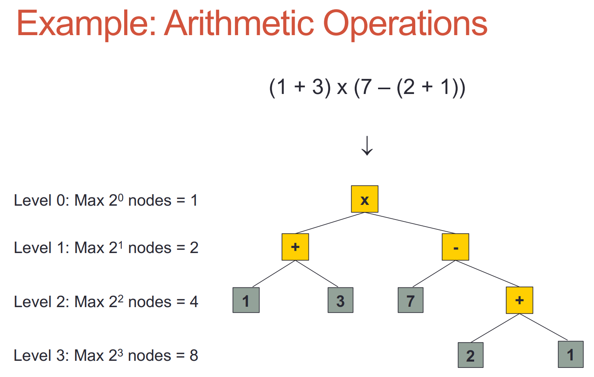
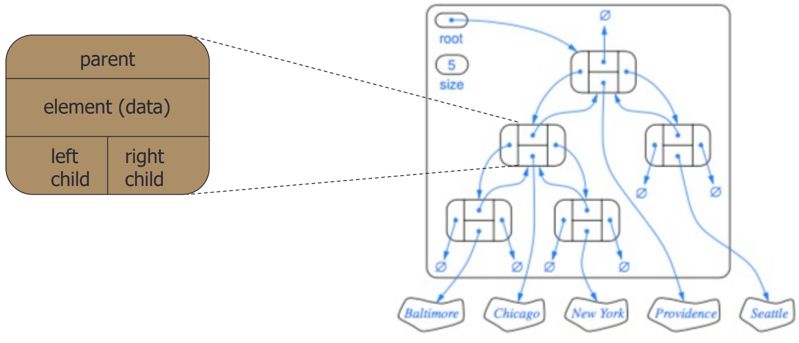

<body style="font-family: serif"></body>

# Trees
(_**Updating**_)

1. [Definition](#definition)
2. [Why Trees?](#why trees?)
3. [Terminology](#terminology)
4. [Tree's Properties](#properties)

## 1 - Definition 
- A tree is an Abstract Data Type (ADT) that stores data **hierarchically** in **nodes**. Look at the example tree below, it looks like a
family tree. In fact, they are similar. Our tree ADTs also use a lot of terminology from family trees.
<div align="center">

</div>

- Formal Definition: a tree is a hierarchical ADT where data is related in terms of parent-child relationships.

## 2 - Why Trees? <a name="WhyTrees"></a>
In the [introduction](./01-intro.md) I emphasized the crucial role of learning data structures for developers, and now, 
you can tell why. Tree data structure can make lots of algorithms much faster relying on its special structure. Ofcourse it also
has disadvantages. Their utility is highly task-dependent, proving immensely advantageous for certain applications (like searching) while
potentially less suitable for others (like finding). We will delve into these aspects shortly.


## 3 - Terminology <a name="Terminology"></a>
- Root: the only node with no parent.
- Siblings: nodes that have the same parent.
- Internal Nodes: any node that has one or more children.
- External Nodes: any node that has no child.
- Ancestor of node _n_: any node above _n_.
  - and ***_n_ itself !!***
- Descendent of any node below _n_.
  - and ***_n_ itself !!!!***
- Edge: a pair of 'father-son' nodes (parent node, child node).
- Path: a sequence of node **from above to below**, the reverse order is NOT a path.
- Subtree: a subtree of tree T at node _v_ is the tree consisting of _v_ and all nodes below _v_ (figure showed below).

<div align="center">

</div>

## 4 - Tree's Properties (this part will definitely appear in your test :) <a name="Properties"></a>
For a node _n_:
- Depth (level) of _n_: the number of nodes above v (v's ancestors excluding v itself). E.g. the depth of a root is zero.
- Degree of _n_: the number of children of _n_. E.g. the degree of an external node is zero.
- Height of a tree T: the maximum depth of an external node of T.
- Height of _n_: 
  - if _n_ is an external node, its height = 0
  - elif _n_ is an internal node, its height = 1 + the maximum height of _n_'s child
  - Note: Height of the tree = height of the root node
  - Also, the height of _n_ is the deepest path's amount of node (not include itself).

## 4 - Define a Tree ADT: ITree
### 4.1 - IPosition (Java)
- Naming convention: all interfaces starts with a capital "I", separating interfaces from classes
- Position: a **Position** is an abstraction for storing an element within a data structure. Consider nodes in the tree as one specific form 
of **Position**.
```
public interface IPosition<T> {
 public T element();
}
```
You may notice the wired `<T>`, which is included in your last semester's OOP course. Yet, I believe after one vocation 
there is nothing left in your head. 
Based on the importance of this concept and its utility in your future labs and assignments,
let's quickly review the concept of generics (泛型) 

#### * Quick Revision: generics
- Why generics? - Because we want data structures compatible to multiple types of data.
- What's generics? - A technique allowing us to replace actual types (like String) with **type parameter** 
  - Type parameter: one or more symbols wrapped by `<>` , in the above case, `T`.
- How generics achieves our expectation? - By specify type parameter behind class name when we create a variable,
the type parameter will become the specified type. Take our familiar ArrayList<E> as an example. We only need to define ArrayList for once, 
and it is compatible to multiple types (String, Integer, Person) of data.
  ```
  ArrayList<String> = strList;
  ArrayList<Integer> = intList;
  ArrayList<Person> = personList;
  ```

So, using generic, we can define our ITree, where T is a generic type. It refers to the types of elements that will be 
stored in this tree:
``` javascript
public interface ITree<T> {
  // returns the position for the root of the tree
  public IPosition<T> root(); 
  // returns the position of p’s parent
  public IPosition<T> parent(IPosition<T> n); 
  // returns an iterator of the positions of p’s children
  public Iterator<IPosition<T>> children(IPosition<T> n);
  // returns true iff p has children (p is an internal node)
  public boolean isInternal(IPosition<T> n);
  // returns true iff p a leaf (p is an external node)
  public boolean isExternal(IPosition<T> n);
  // returns true iff p==root()
  public boolean isRoot(IPosition<T> n);
  // returns the amount of nodes
  public int size();
  // returns true iff the tree is empty
  public boolean isEmpty();
  // returns an iterator of every element in the tree
  public Iterator<T> iterator();
  // returns an iterator of every position in the tree
  public Iterator<IPosition<T>> nodes();
  // replaces the element at position p with e
  public T replace(IPosition<T> n, T e);
}
```

### 4.2 - Iterator (Java)
Iterator is important and very common-used in your future coding projects. It is a Java build-in interface with the aim to
traverse a sequence of element. 
- `public boolean hasNext();`: an Iterator method that returns a boolean value
  - true if and only if (iff) there is another element available.
  - false iff there is not
- `public T next();`: an Iterator method that returns the next element in the sequence. When you firstly call this method,
it will return the first element as the 'next element'.


# Binary Trees

## 1 - Definition
A binary tree is a special type of tree, which have following additional properties:
1. Every node has at most 2 children (degree <= 2).
2. A node's children have order
   1. they're labelled as being either a left child or a right child.
   2. a left child comes **BEFORE** a right child i.e. whenever we have to process the children of a node, we do the left one first, 
then the right.

*Note: furthermore, we define a Binary Tree in which all nodes have degree 0 or 2 as Proper Binary Tree.

## 2 - Binary Trees' Level Property
Level d of a binary tree is the set of all nodes with 
depth d, of which there are at most 2d nodes.
<div align="center">

</div>


## 2 - Binary Trees ADT

Except operations of Tree ADT, Binary Tree ADT has 4 extra operations:
```
public interface IBinaryTree<T> extends ITree<T> {
  public IPosition <T> left(IPosition <T> p);
  public IPosition <T> right(IPosition <T> p);
  public boolean hasLeft(IPosition <T> p);
  public boolean hasRight(IPosition<T> p);
}
```
#### *Note: 
- Do u still remember what keyword `extends` means? 
  - Here, `extends` indicates IBinaryTree **interface** contains all the methods from ITree **interface**.
  - It can be also used to create inherited relationship between **classes**.
- How about keyword `implement`? 
  - `implement` means one **class** must implement all the methods in an **interface**.

## 3 - Implementation: Link-Based Binary Tree

### 3.1 - Visual Structure
You may have noticed that we still have any methods to add / remove a node from the tree. Based on different implement
strategy, the parameters of methods add & remove may not be the same. 

For example, if we adopt array-based binary tree, 
we may need two int parameter representing index and value respectively. Here, let's see a more common-used implement 
strategy for tree (link-based strategy). 

The following diagram presents the structure of such a tree:
<div align="center">

</div>

- each position possesses:
  - parent node
  - left node
  - right node
  - value stored inside it

To simplify the implementation process, instead of implementing linked binary tree, let's implement Proper Linked Binary 
Tree.

### 3.2 - Implementation: Link-Based Proper Binary Tree
To further simplify the question, we define that
- **only internal nodes can hold data**.
### 3.3 - method _expandExternal(p,e)_ (add nodes)
*Note that `expandExternal(p,e)` means adding nodes at the position of a leaf node, instead of inserting (we will learn how to insert at next file).

To do that, we need to expand 


