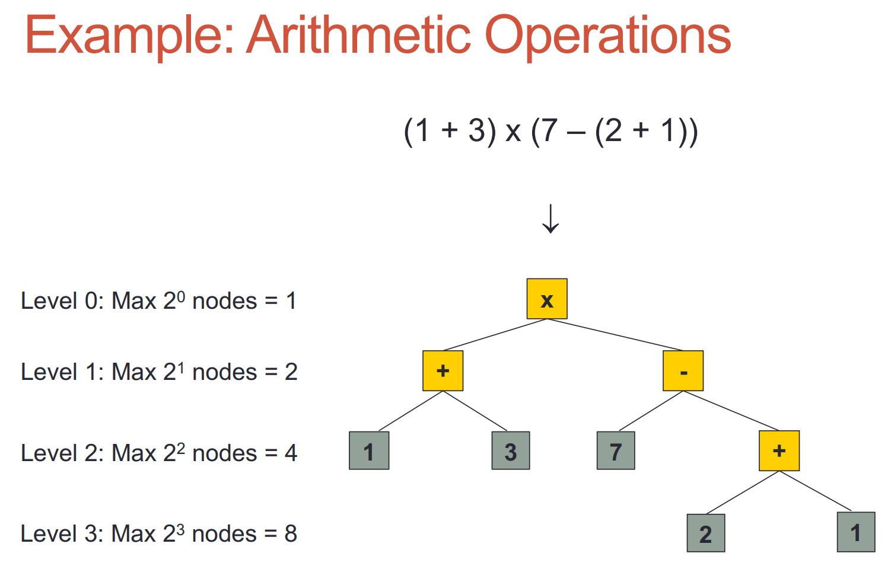

<body style="font-family: serif"></body>

# Binary Trees
(_**Completed**_)
1. [Definition](#definition)
2. [Binary Trees' Level Property](#2)
3. [Binary Trees ADT](#3)
4. [Implementation: Link-Based Binary Tree](#4)

## 1 - Definition <a name="definition"></a>
A binary tree is a special type of tree, which have following additional properties:
1. Every node has at most 2 children (degree <= 2).
2. A node's children have order
   1. they're labelled as being either a left child or a right child.
   2. a left child comes **BEFORE** a right child i.e. whenever we have to process the children of a node, we do the left one first, 
then the right.

*Note: furthermore, we define a Binary Tree in which all nodes have degree 0 or 2 as Proper Binary Tree.

## 2 - Binary Trees' Level Property <a name="2"></a>
Level d of a binary tree is the set of all nodes with 
depth d, of which there are at most 2d nodes.
<div align="center">

</div>


## 3 - Binary Trees ADT <a name="3"></a>

Except operations of Tree ADT, Binary Tree ADT has 4 extra operations:
```
public interface IBinaryTree<T> extends ITree<T> {
  public IPosition <T> left(IPosition <T> p);
  public IPosition <T> right(IPosition <T> p);
  public boolean hasLeft(IPosition <T> p);
  public boolean hasRight(IPosition<T> p);
}
```
#### *Note: 
- Do u still remember what keyword `extends` means? 
  - Here, `extends` indicates IBinaryTree **interface** contains all the methods from ITree **interface**.
  - It can be also used to create inherited relationship between **classes**.
- How about keyword `implement`? 
  - `implement` means one **class** must implement all the methods in an **interface**.

## 4 - Implementation: Link-Based Binary Tree <a name="4"></a>

### 4.1 - Visual Structure
You may have noticed that we still have any methods to add / remove a node from the tree. Based on different implement
strategy, the parameters of methods add & remove may not be the same. 

For example, if we adopt array-based binary tree, 
we may need two int parameter representing index and value respectively. Here, let's see a more common-used implement 
strategy for tree (link-based strategy). 

The following diagram presents the structure of such a tree:
<div align="center">

</div>

- each position possesses:
  - parent node
  - left node
  - right node
  - value stored inside it

To simplify the implementation process, instead of implementing linked binary tree, let's implement two methods in Proper Linked Binary 
Tree.

### 4.2 - Implementation: Link-Based Proper Binary Tree
We define that (further simplify the question): only internal nodes can hold data.

#### 4.2.1 - _expandExternal(p,e)_
- Create two new empty positions (i.e. that have no elements) and add them 
as the left and right children of _p_, and store element e at _p_. An error occurs if _p_ is not external.

*Note: `expandExternal(p,e)` means adding nodes at the position of a leaf node (internal nodes cannot be expanded), instead of inserting. We will learn 
how to insert later. 

#### 4.2.2 - _remove(p)_
- If the left child of node _p_ is external, remove _p_ and its left child, then replace _p_ with the right child. 
- If the right child is external, remove _p_ and its right child, then replace it with the left child. Error if both 
children are internal or _p_ is external.

*Note: `remove(p)` can only remove an internal node with at least one external child can be removed.


