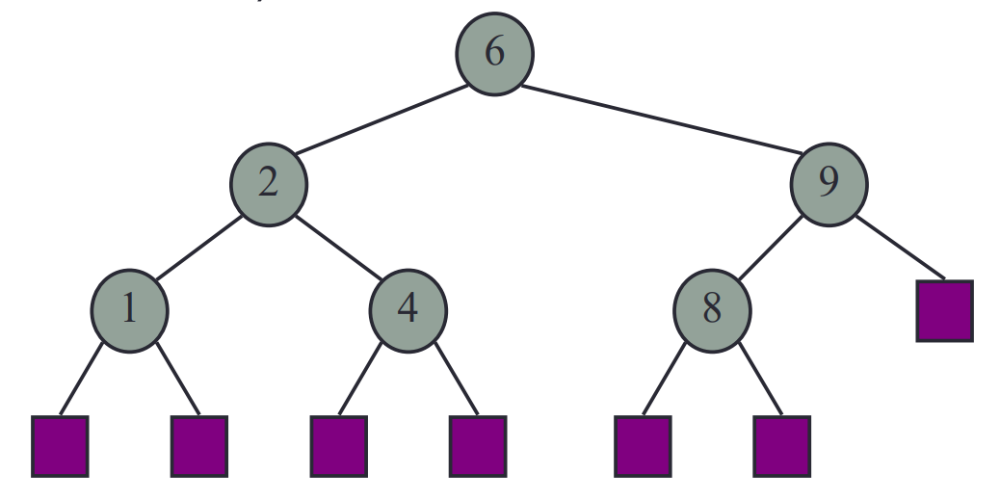
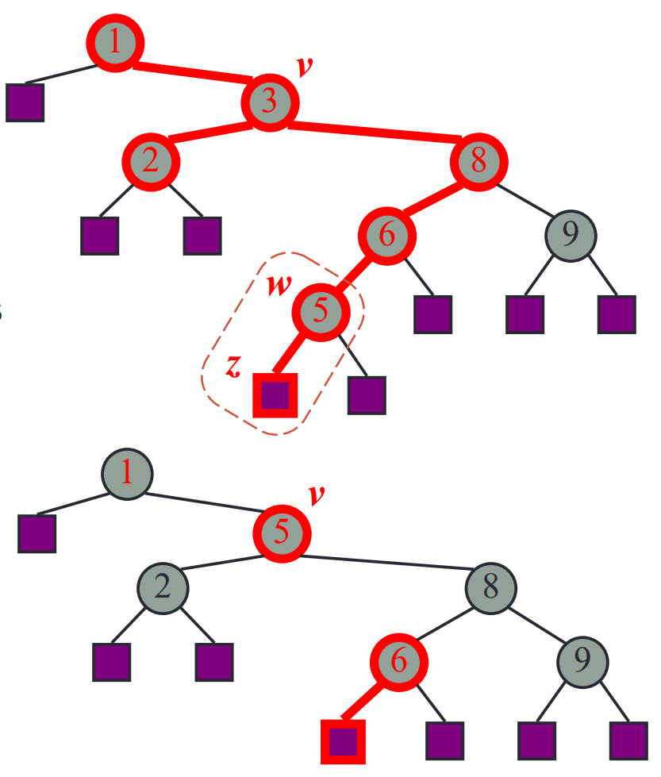
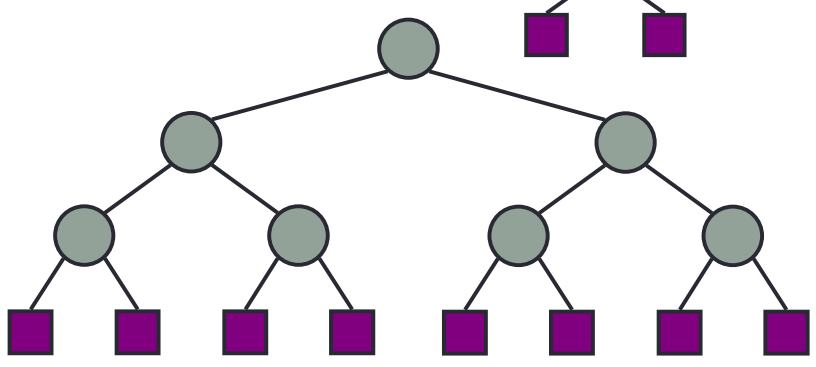
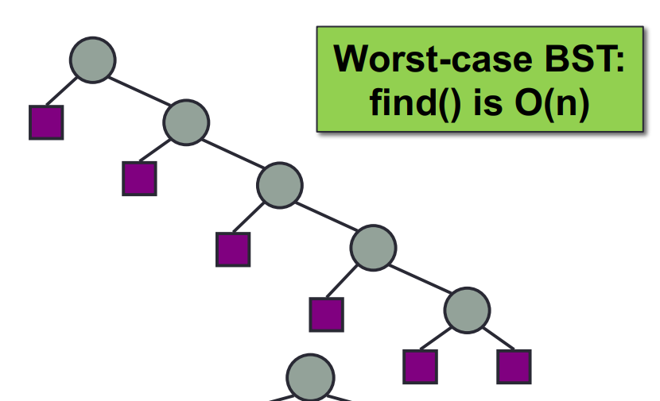

# Binary Search Tree (BST)
(_**Completed**_)
1. [Definition](#1)
2. [Example](#2)
3. [BST Interface](#3)
4. [Implementation](#4)
5. [Performance](#5)

## 1 - Definition <a name="1"></a>
A binary search tree is a special type of binary trees. It possesses following characteristics:
1. Each internal node holds a value
2. A _total-order relation_ is defined on those values (a.k.a. those values are comparable)
3. **The left sub-tree of a node contains only values that are less than the nodes value.**
4. **The right sub-tree of a node contains only values that are greater than the nodes value.**

*Note: do you still remember and can distinguish following concepts? If you forget, revise the previous slides!
- tree, binary tree, proper binary tree

## 2 - Example <a name="2"></a>
<div align="center">

</div>

From the image above we can clearly see why _inorder traversal_ will visit nodes in sorted order.

## 3 - BST Interface <a name="3"></a>
Note here I do not use the example in the slides to **simplify** the process and hope make it more understandable to you.
``` javascript
public interface IBST<T> {
    // find the node containing k starting from node n
    public IPostision<T> find(k,n);
    // Insert a node containing value k
    public void put(k); 
    // Remove the entry with key k from the tree.
    public void remove(k);
}
```

## 4 - Implementation <a name="4"></a>
### 4.1 - find(k,n) 
The most important methods in the interface since it will be used in many other methods.

Starting at node n:
- If k is found, returning the node containing the entry with key k.
- elif k is not found, returning the external node where the search ends.
 


```
Algorithm find(k, n)
    if T.isExternal(n)
        return n
    if k < n.key()
        return find(k, T.leftChild(n))
    else if k > n.key()
        return find(k, T.rightChild(n))
    else
        return n
```
Clearly this is a recursive method (as it calls itself). In this method, when we reach the base and return node n, n will
be returned to the initial caller without change.
### 4.2 - put(k)
We want to insert k to the tree:
- if there is no node containing k: find the leaf node and expand it (do u remember [_expandExternal(p,e)_](03-binary-trees.md) method?)
- elif there is a node containing k: do nothing

### 4.3 - remove(k)
To remove k from the tree:
- if there is no node containing k: do nothing
- elif there is a node _v_ containing k:
  - if node _v_ has only one internal child, we directly remove it (using [_remove(p)_](03-binary-trees.md)).
  - elif node _v_ has only one internal child nodes:
    - we need to find the node _w_ containing next biggest value in the tree after k
    - copy the value of _w_ into _v_
    - remove _w_ and its left child _z_
    - 

## 5 - Performance <a name="5"></a>
Do you remember Big O Notation? - Check it out [here](01-intro.md) if you forget.
### 5.1 - Space Performance
For a tree storing **n** values, we will have:
- **n** internal nodes
- **n + 1** external nodes (root node will produce 2 external nodes, other internal nodes will increase 1 external nodes for each)
- So the space usage is therefore O(2n+1) = O(n)
### 5.2 - Time Performance
Insertion operation and removal operation alone both are O(1). 
- The major time cost for each is the cost of find(…).
  - The best circumstance: the tree is **balanced**! find() is `O(h) = O(log n)`, where h is the height of the tree
    - 
  - The worst case: 
    - 

So, what's the meaning of 'balanced'? - We will explore it at next chapter