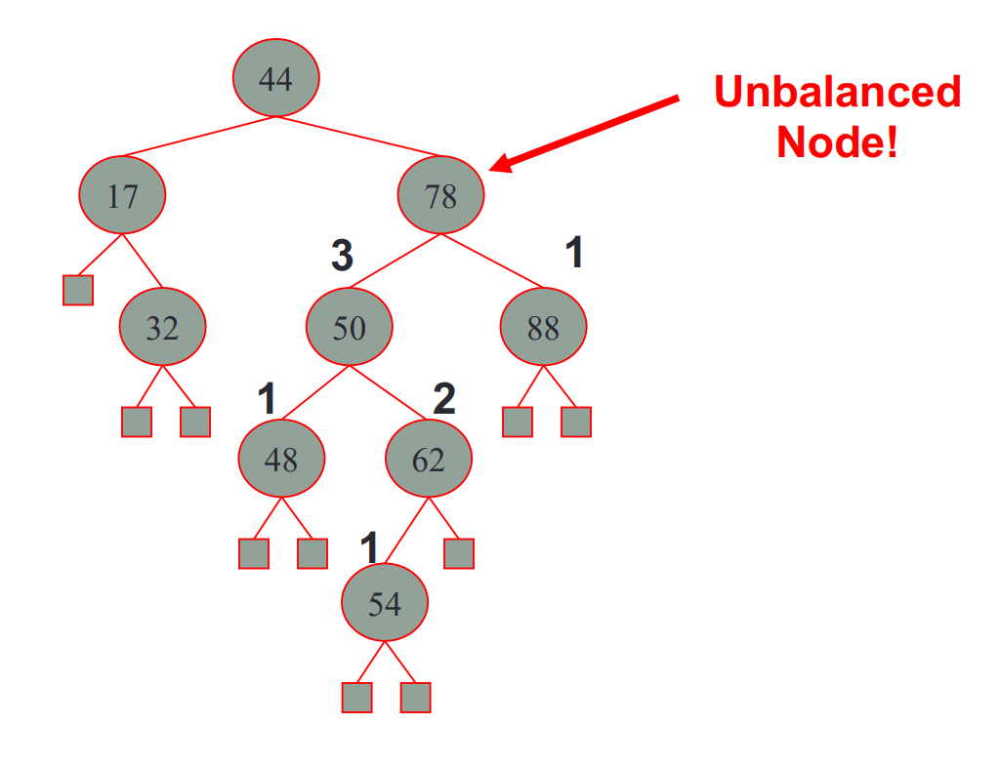
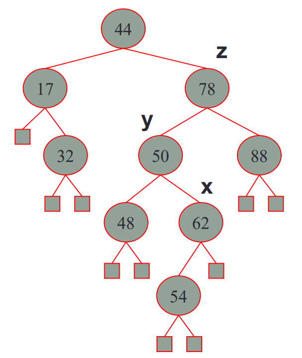
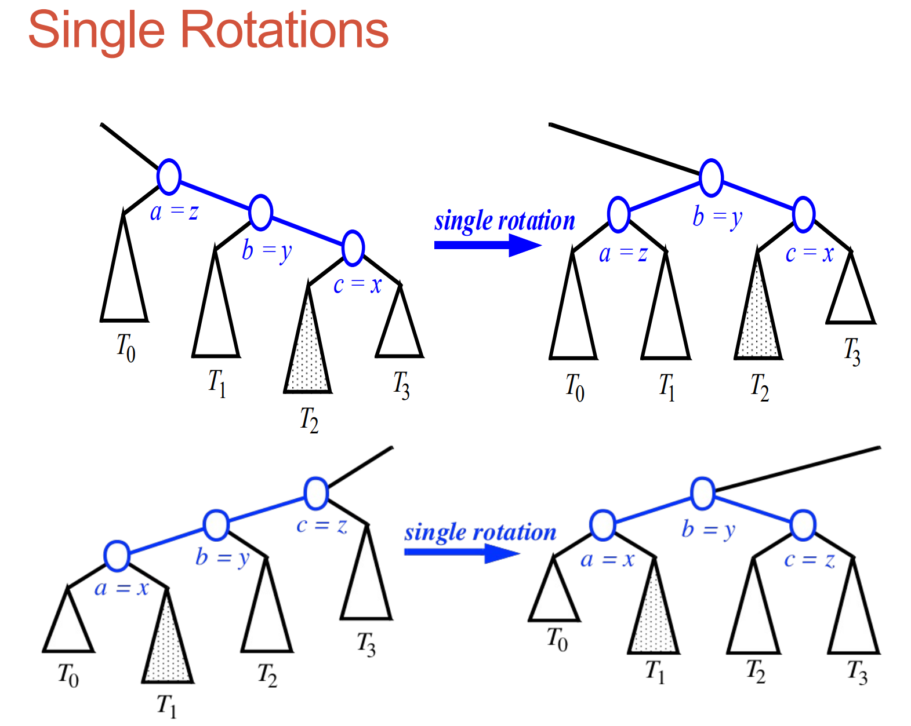
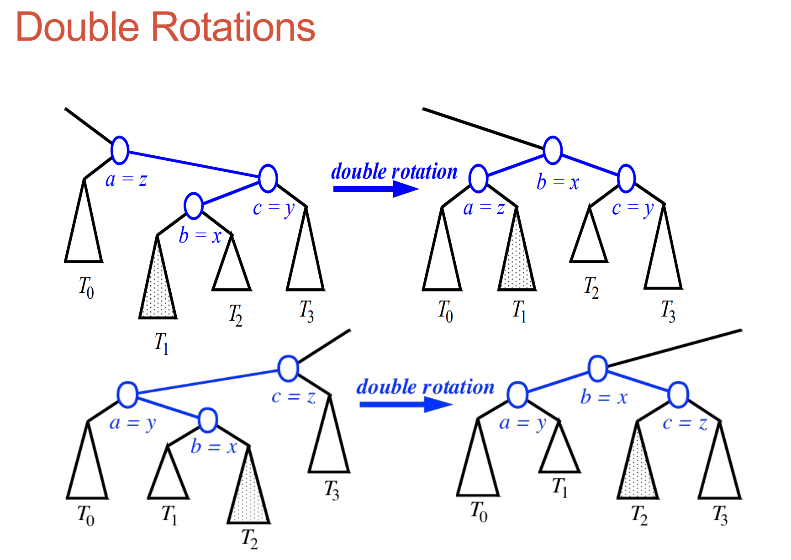
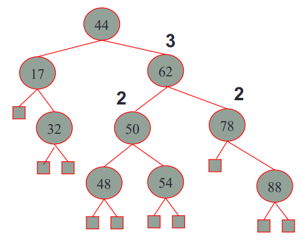
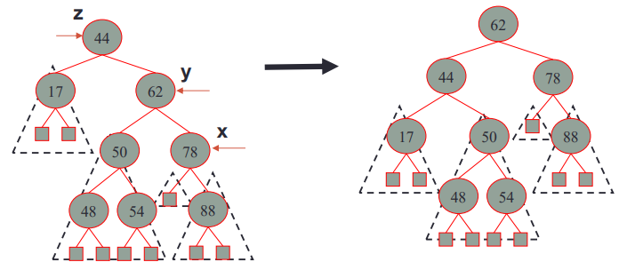

# AVL Tree
(_**Updating**_)

## 1 - Motivation
In the last chapter, I introduced that the time performance of find method is best, `O(log n)`, when the binary search tree is balanced. 

So, why don't we create a class that's automatically balanced? - This is the motivation of the AVL tree. 

## 2 - Definition
AVL trees are **self-balancing** binary search tree, which means AVL trees satisfy the following property:
- height-balance property: for every internal node _v_ in tree T, **the heights of the children of _v_ can differ by at most 1**.

Remember our objective is:
- Creating a class, with which other programmers do not need to worry about the undesirable time performance caused
by bad tree structure when they operate the tree (add, delete nodes), as the class is **self-balancing**.

Therefore, it's our responsibility to balance the tree inside the class. Let's see what should we do.

#### The following parts will be quite tedious, but it's necessary to complete your assignment.

## 3 - Insertion: put(k, v)
### 3.1 - Begin with Expansion and Property Check
Remember, AVL trees are self-balancing binary search tree, which means we can insert a new node just like a binary
search tree (by comparing keys). The expected performance of this operation is O(log n).

**Notice here!** As I said above, the key difference between AVL trees and common BSTs is that after insertion, we need
to check if the height-balance property still holds:
- we need to search upwards begin from the newly inserted node
- for each node we visit, we check if whether its height-balance property holds by **compare the height** of its children
  - if the difference in height between the two children is greater than 1, the tree becomes unbalanced! For example, after we
inserted a node with key 54, the tree becomes unbalance:
  

    
  

### 3.2 - How to make unbalanced tree balanced again? - restructure
Since we need to restore the height-balance property of the AVL tree, we need to **restructure** it.

Let's label the crucial nodes in this restructuring process: 
1. _z_: the first unbalanced node encountered while travelling up the tree from the newly expanded node.
2. _y_: the child of _z_ with larger height
3. _x_: the child of _y_ with larger height
  

    
  

There are two cases of restructuring operation: Single Rotation & Double Rotation. Each one represents a type of unbalanced tree structure (there will be 
two and only these two types because every time we insert a node, a property check will be performed).

#### 3.2.1 Single Rotation
For single rotation, two types of structure might occur as diagram below, **where let (_a_, _b_, _c_) be an inorder listing of _x_, _y_, _z_** (i.e. a is smallest 
value, followed by b, followed by c).

It only requires one time of **_'rotation' (an intuitive expression for restructuring)_** to restore height-balance property.

#### 3.2.2 Double Rotation
For single rotation, two types of structure might occur (diagram shown below).
It only requires two times of **_'rotation'_** to restore height-balance property.

#### 3.2.3 What Happened Exactly?

It's a little confusing right? Let's delve into the problem deeper.
**Question: why we label node _x_, _y_, _z_?**
- Answer: Because we want to get the first three node leading to unbalanced, and starting from the unbalanced node we found in [property check](#check).
By change their structure, we can restore height-balancing property (reducing its height!).

Therefore, we can conclude a general rule for AVL tree insertion:
1. Make b (middle value) the root of the subtree being restructured.
2. Make a (the smallest value) the left child of b and make T0 and T1 its children
3. Make c (the largest value) the right child of b and make T2 and T3 its children.
### 3.2.4 After Insertion
The subtrees attached to these nodes will be added as children in the same left-to-right order as before
-> remaining the property of binary search tree! For example, the result of [inserting node with key 54](#54) is shown below:

## 4 - Removal
Just like removal in binary search tree, when we want to remove a node _n_ in a tree:
- if there is no node: do nothing
- elif node _n_ is in the tree:
  - if node _n_ has only one internal child, we directly remove it.
  - elif node _n_ has two internal child nodes:
    - we need to find the node _w_ containing next biggest value in the tree after _n_
    - copy the value of _w_ into _n_
    - remove _w_ and its left child

Yet, we need to maintain the self-balancing property of the avl tree. Therefore, we should perform property check and
restructure. 
### 4.1 - Rebalancing after a Removal
Similarly, let's define:
- the first unbalanced node as _z_.
- the child of _z_ with the larger height as _y_.
- the child of _y_ with the larger height as _x_ (if y has children of equal heights, we choose the side 
that will result in a single rotation).

Then, we perform restructure(x) to restore balance at _z_.

### 4.2 - Continuous Property Check!
**ATTENTION**! 

Unlike insertion, removal in AVL tree might require multiple restructure operations. Thus, we must **continue**
checking for balance until the root of the tree is reached.
- In the above case, 62 is the root, so we have balanced the tree!

